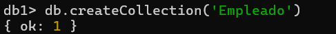
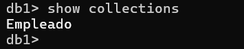
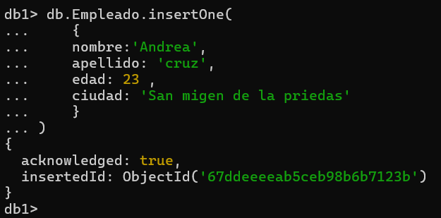

# MongoDB Crued 

## Crear una bose de datos

**solo se crea si tiene una coleccion** 


```json
use 'nombre de la base de datos'

use db1

```


`use db1
db.createCollection('Empleado')`


## Mostrar la collection 
`show collections`



## Insercion de un Documento

```json
db.Empleado.insertOne(
    {
    nombre:'Andrea',
    apellido: 'cruz',
    edad: 23 ,
    ciudad: 'San migen de la priedas'
    }
)
```



---
---
# INCERCION DE UN DOCUMNTO MAS COMPLEJO 

```Json

db.Empleado.insertOne({
    nombre: 'ivan',
    apellido: 'Baltazar',
    apellido2: 'rodrigez',
    aficiones:['Cerveza', 'canabis','crico', 'mentir']
})

```

**Eliminar una Collection** 
```Json
db.coleccion.drop()
```
__Ejemplo__
```Json
db.empleado.drop()
```

---
---
### para 

# Insercion de documento mas complejos con anidados, arays y id
```Json
db.alumnos.insertOne(
{
    nombre: 'jose Luis',
    apellido: 'Lopez' ,
    apellido2: 'torres',
    edad: 33,
    estudios: [
        'Contaduria',
        'Desarollo de negocios'
    ],
    experiencias:{
        lenguaje:'sql' ,
        sgb:'sqlServer' ,
        anios_experiencia: 666 
        }
})
```

```Json
db.alumnos.insertOne({
    _id:3,
    nombre:'sergio',
    apellido:'Ramos',
    equipo:'America',
    aficiones:['dinero','cariñosa', 'ser Cariñoso'],
    talentos:{
        futbol:true,
        bañarse:false
    }
}
)
```
---
## INSERTAR MULTIPLES DOCUMENTOS


```Json
db.alumnos.insertMany(
[
    {
        _id:12,
         nombre:'Oswaldo',
         edad: 303,
         desfripcion: 'El mejode de todas'
    },

    {
        nombre: 'Mariana',
        apellido: 'repollo',
        edad: 17,
        habilidades:['Ser vivora', 'ilucionar', 'blanca'],
        
        direccion:{
            calle: 665
        },
        esposos:[
            {
                nombre: 'Joushua',
                edad:8,
                pencion: -23,
                hijos:['ivan', 'yayo']
            },
            {
                nombre: 'leo',
                edad:21,
                pencion: 500,
                complaciente:true
            }
        ]

        }
    
])
```
---
# Busquedas 
### condiciones simples de igualdad metodo find()

1. selecionar todos los documentos de la Collection libros

```Json
db.libros.find({})
```
2. selecionar todos lo documento que sean de la editorial  `Biblio`

```Json
db.libros.find({editorial: 'Biblio'})
```

3. mostrar todos los documentos que el precio sea de `precio: 25`

```Json
db.libros.find({ precio: 25})
```
4. selecionar todos los documentos que el `titulo` sean `JSON para todo`


```Json
db.libros.find({titulo: 'JSON para todos'})
```
---
# Operadores
### Operadores de comparacion

 [Operadores de comparacion](https://www.mongodb.com/docs/manual/reference/operator/query/)

 

1. moatrar todos lo documentos donde el precio sea mayor a 25
```Json
db.libros.find({ precio :{$gt: 25}})
```

2. mostrar lo documento donde el precio sea de 25
```Json
db.libros.find({ precio :{$eq: 25}})

db.libros.find({ precio: 25})
```

3. mostrar lo documento donde el precio sea menor a 5
```Json
db.libros.find({ cantidad :{$lt: 5}})
```
---
#  mostrar los documentos que pertenecen a la editorial  directorio o planeta

```Json
db.libros.find(
{editorial: { $in: ['Biblio', 'Planeta',] 
}
 })
```

## mostrar todos los documentos que cuesten 20 0 25

```Json
db.libros.find(
{precio: { $in: [20, 25,] }})
```

## mostrar tosos los documentos que cuesten 20 o 25
```Json
db.libros.find(
{precio: { $nin: [20, 25,] }})
```

# introduccion fienOne

7. recuperar una sola fina (solo nosda el primer elemento que cumpla con la condicion)

```Json
db.libros.findOne(
    {
        precio: { 
        $nin: [20, 25,] 
                }
    }
)
```

# Ooeradores logicos 
[Ooeradores logicos](https://www.mongodb.com/docs/manual/reference/operator/query-logical/)

### operador  `AND`
- dos pocibles occiones
    1. La simple, mediante condiciones separadas para campos
    - db.libros.find({'condicion1',condicion2})  ->con esto asume que es una `AND`
    2.usando el operador `$and`
    - { $and: [ { <expression1> }, { <expression2> } , ... , { <expressionN> } ] }
    - db.libros.find({'condicion1',condicion2})
1. mostrar todos aquellos libros que cuenten mas de 25 y cuya cantidad sea menor a 15

```sql
db.libros.find(
    {
        precio:{$gt:25}
        ,
        cantidad:{$lt:15}
    }
)
```
```sql
db.libros.find(
    {
        $and:[
        {precio:{$gt:25}}
        ,
        {cantidad:{$lt:15}}
    ]
    }
)
```

# Operadoresr `Or` $or

    1. mostrar todos aquellos libros que cuesten mas de 25 o cuya cantidad sea inferior a 15

```Json

db.libros.find(
    {
        $or :[
            {
                Biblio:{$gt: 25}
            },

            {
                cantidad: {$lt: 20} 
            }
        ]
    })

```

### ejemplo con and y or convinados
1. mostarr todos los libros de la editorial biblio con precio mayor a 40 o libros de la editorial planeta con precio mayor a 30

```json

```
```json
db.libros.find(
    {
       $and:[
        {
             $or :[ { editorial: "Biblio"}, {precio: { $gt: 40 } }]},

        {  $or :[ { editorial:"Planeta"},{precio: { $gt: 30 } } ]}
       ]
    }
)

```
# Proyecciones (ver ciertas columnas)

1. sele cionar todos los libros solo mostrando el titulo

```json
db.libros.find({Filtros}, {columnas})

db.libros.find({}, {titulo:1})

db.libros.find({}, {titulo:1, _id:0})

db.libros..find(
  {},
  { _id: 0, titulo: 1, editorial: 1, precio: 1 }
);
```

# Operador exists (estp permite saber si un campo se encuentra en un documento)

db.libros.find({editorial: {$exists: true}})

- Buscar todas los documentos que no tengan cantidad

db.libros.find({cantidad: {$exists: false}})

# operador Type (este permite solicitar a mongo db si un campo coresponde a un tipo)

[Operador Type](https://www.mongodb.com/docs/manual/reference/operator/query/type/)

- mostrar todos los documrntos donde el precio sea de tipo double o cualquier otro tipo de dato

db.libros.find(
    {
        precio:{$type:1}
    })

### El 16 es un tipo de dato int
db.libros.find(
    {
        precio:{$type:16}
    })

db.libros.insertMany([
    {
        _id:12 , 
        titulo:'IA',
        editorial: 'Terra',
        precio:125,
        cantidad:20
    },
    {
        _id: 13,
    titulo: 'Pyton para todos',
    editorial: '2001',
    precio: 200,
    cantidad:55
    }
    ]
)

-- Seleccionar todos los documentos de libros donde los valores de la editorial sean string

tipo string
db.libros.find({editorial: {$type:2}})

tipo int
db.libros.find({editorial: {$type:16}})

# Modificar documentos
## comandos inportantes

1. updateOne -> modificar un solo documento
2. updateMany -> modificar multiples documentos 
1. replaceOne -> sustituir el contenido de un documento

#### Tiene el siguiente frormato

```json
db.collection.updateOne(
    {filtro},
    {operador: }
)
```


[Operadores update](https://www.mongodb.com/docs/manual/reference/operator/update/)

**Operador $set**

1. Modificar un documento

```json

    db.libros.updateOne({titulo: 'Pyton para el muindo'}, {$set: 'Java para todos'})    

```
- utinisando todo updaremeny

1. modificar todos los libros sean mayor a 100 y campviarlo a 150

```json
  db.libros.updateMany(

    {precio:{$gt:100} },
    {$set:{precio:150}}
  )
  ```

### Operadores $inc y $nul

* incrementar tosos los precios de los libros en 5
  
```json
db.libros.updateMany(
    {},
        {$inc:{precio:5}}
  )
  ```


*   incrementar tosos los precios de los libros en 5 y la editorial terra

```json
db.libros.updateMany(
    {editorial:'Terra'},
        {$inc:{precio:5}}
  )
```
```json
  db.libros.find({})
```

  1. multiplicar todos los libros donde la cantidad sea mayor a 20 en su cantidad por 2
```json
   db.libros.updateMany(

    {cantidad:{$gt:20} },
    {$mul:{cantidad:2}}
  )
  ```
```json
  db.libros.find({_id:{$in:[1,7,10,13]}})
```


### Actualizar todos libros 

    2. multiplicar por 2 la cantidad y el precio de aquelloos libros donde la el presio sea mayor a 20

```json
   db.libros.updateMany(
    
    {precio:{$gt:20} },
    {$mul:{cantidad:2}}
  )
  ```

  ```json
   db.libros.updateMany(
    
    {precio:{$gt:20} },
    {$mul:{precio:2}}
  )
  ```

  ## Replasar documentos (repleaceOne)

  - Actualizar todo el documento de id 2 por el titulo : el mejor soy yo, editorial: Terra , precio: 666

```json
db.libros.replaceOne({_id:2},{titulo:'El megor jugando Free',editorial: 'Terra',precio: 666,})

```
## Borrar documentos 
- delateOne     ->  Elimina un documento
- delateMany    ->  Eliminar multiples documentos

```json
db.libros.delaneOne({_id:2})
```

- eliminar todos los libros de la cantidad sea mayor a 150

```json
db.libros.deleteMany({cantidad:{$gt:20}})
db.libros.deleteMany({})
```
## Expreciones regulares
- Selecionar todos los libros que contengan una `t` minuscula
```json
db.libros.find({titulo:/t/})
```
- Selecionar todos los libros que en el titulos contenga la palabra `JSON`

```json
db.libros.find({titulo:/JSON/})
```
- selecionar todos los documentos de los libros que terminen con `tos`

```json
db.libros.find({titulo:/tos$})
```

- selecionar todos los documentos que en el titulos comiensen con `J`
```json
db.libros.find({titulo:/^J/})
```
## Operadores $regex
## Metedo stort (Ordenar documentos)


- Selecionar todos los libros que en el titulos contenga la palabra `JSON`

```json
db.libros.find({titulo:{$regex:/JSON/}})

```

distingir entre mayusculas y minusculas 

```json
db.libros.find({titulo:{$regex:/json/i}})

```

selecionar todos los documentos de libtos donde el titulo comiense con j y que no distinga con mayusculas y miusculas

```json
db.libros.find({titulo:{$regex:/^j/, $options:'i'}})

```
termina en es:

```json
db.libros.find({titulo:{$regex:es$, $options:'i'}})

```

oedenar los libros de manera decendente por el precio

db.libros.find({}, {_id:0,titulo:1,precio:1}).sort({precio:1})


oedenar los libros de manera acendente por el precio

db.libros.find({}, {_id:0,titulo:1,precio:1}).sort({precio:-1})


### metodo skip

db.libros.find({}).zize()

### metodo limit
. Buscar todos los libros pero mostrando los dos primeros

db.libros.find({}).limit(2)

salta los dos primeros documentos 
db.libros.find({}).skip(2)
