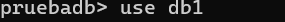

# MongoDB Crued 

## Crear una bose de datos

**solo se crea si tiene una coleccion** 


```json
use 'nombre de la base de datos'

use db1

```


`use db1
db.createCollection('empleado')`


## Mostrar la collection 
`show collections`


## Insercion de un Documento

```json
db.Empleado.insertOne(
    {
    nombre:'Andrea',
    apellido: 'cruz',
    edad: 23 ,
    ciudad: 'San migen de la priedas'
    }
)
```

